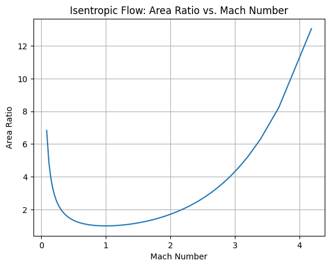

# Area Ratio vs. Mach Number Using Cantera

## Overview

This project calculates the area ratio versus Mach number curve for isentropic, adiabatic flow. The program can utilize a specified gas object with defined stagnation state properties or defaults to a hydrogen/nitrogen mixture at a stagnation temperature of 1200 K.

## Features

- **Isentropic Flow Calculations**: Compute area ratios and Mach numbers for given gas properties.
- **Flexible Input**: Allow custom gas objects or use default hydrogen/nitrogen mixture.
- **Data Visualization**: Generate plots for area ratio versus Mach number.

## Requirements

- Python 3.x
- Cantera
- NumPy
- Matplotlib

## Installation

You can install the required packages using pip:

```bash
pip install cantera numpy matplotlib
```

## Usage

1. Clone this repository:

    ```bash
    git clone https://github.com/iammohith/Area-Ratio-vs-Mach-Number-Using-Cantera.git
    cd Area-Ratio-vs-Mach-Number-Using-Cantera
    ```

2. Run the script:

    ```bash
    python your_script.py
    ```

Replace `your_script.py` with the actual script name.

3. The output will be displayed, and if Matplotlib is available, a plot will be shown.

## Output

The output of the calculations will be displayed in the console, and the area ratio vs. Mach number curve will be plotted. Below is an example of the result:



## Contributing

Feel free to submit issues or pull requests for any improvements or suggestions.
